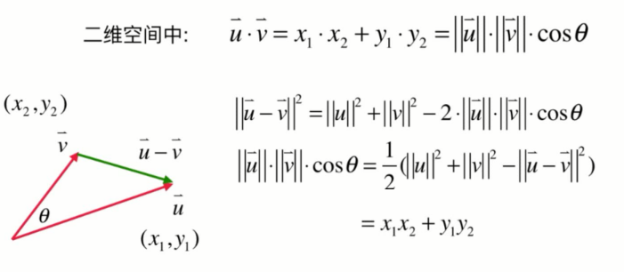
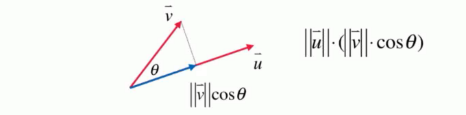
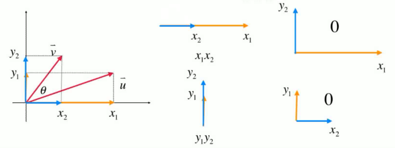
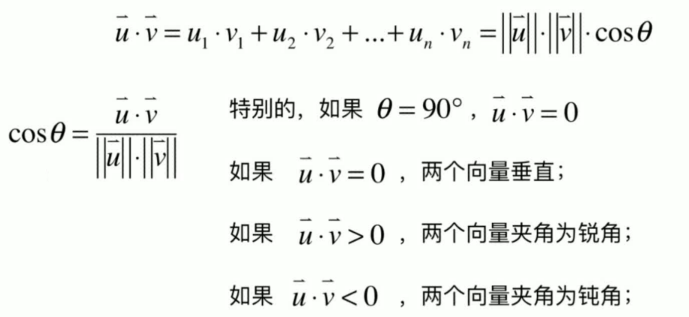
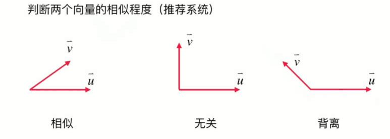
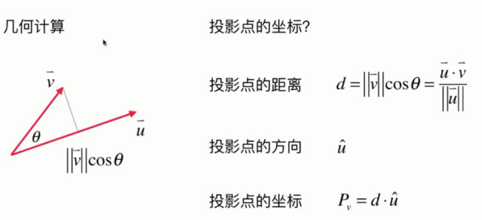

# 什么是向量(vector)?
向量是一组有序的数。可以用方向和空间来描述。
-   用向量表示物理空间中的方向，最多使用三个维度的向量
-   可以用 N(高维)空间去表达事物 -> 多角度描述事物，但是N维空间无法直观感知到，只能抽象的理解（高维空间中的向量点）

# 如何理解向量的加法和数乘？

-   加法，向量的位移
-   乘法，本质多次加法操作

# 向量的模和单位向量是什么？
- 模是向量的长度。表示向量的大小。
- 单位向量是长度为1的向量。表示向量的方向。

# 标准单位向量是什么？
只由0，1组成的单位向量，指向坐标轴的正方向。
- 二维：(0,1) (1,0)
- 三维：(1,0,0)  (0,1,0)  (0,0,1)

# 如何理解向量的点乘？
$$\vec{u}\cdot\vec{v}=x_1 \cdot x_2+y_1 \cdot y_2=\|\vec{u}\|\cdot\|\vec{v}\|\cdot cos\theta$$

两个向量的点乘是一个数（标量）。
不同方向的向量不能直接做乘法，所以将一个向量投影到另以一个向量上，使他们指向相同的方向做乘法。

# 向量点乘有什么应用（意义）？
1. 判断两个向量的夹角。

2. 推荐系统，每个数据都是高维空间中的一个点，判断相似程度。如果两个向量重合，则点乘值最大，最相似。

3. 几何计算
