# 看待矩阵的四个视角是什么？
1. 二维数据
2. 系统（线性系统：线性方程组）
3. 变换（矩阵作为向量的函数:$T\cdot\vec{a}=\vec{b}$）
4. 空间

## 矩阵是对系统的描述
直观地理解矩阵。

「矩阵是对系统的描述」

系统可以用方程组来描述，而矩阵可以表示方程组。

矩阵的每一行都是一个方程，每一列代表未知数在方程中的系数。

矩阵和向量的乘法中，行向量*向量 还原方程，向量的点乘。
有一点注意：矩阵的列数和向量的行数相等，相对应的未知数一直，维度一致。矩阵的行数与结果向量的行数相等，是对应方程组的个数。

矩阵乘以向量：
从**行向量**的视角看待矩阵，可以将矩阵看做是向量的函数：$$A\cdot\vec{x}=\vec{b}$$
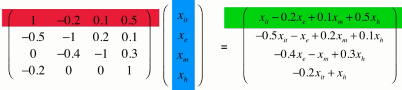
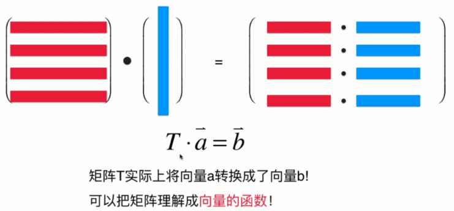

矩阵乘以矩阵：
可以视为 矩阵*(矩阵中的列向量)：同一个方程组对不同未知数取值的解。
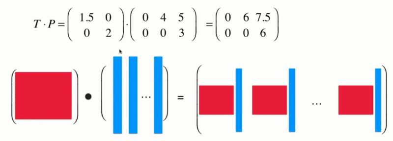

## 矩阵与图形变换

错切的变换矩阵：找到变换矩阵$T$
y轴保持不变，x的变换与y值成比例（y的a倍）。
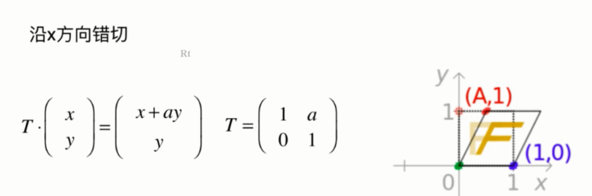

旋转的变换矩阵的推倒？
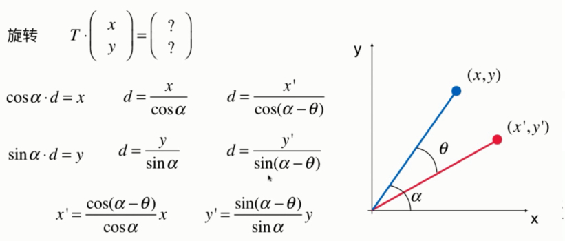
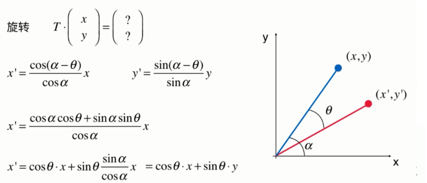

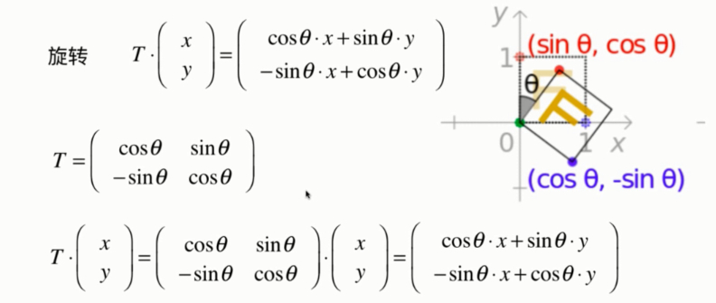
思考：三维矩阵？平移操作（仿射变换）？图形学

# 如何理解「用矩阵表示空间」？
从**列向量**的角度描述矩阵。矩阵的列数和向量的个数一致（维度一致）

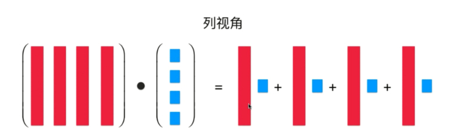
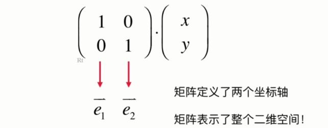
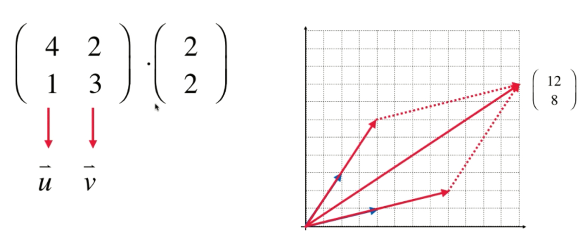
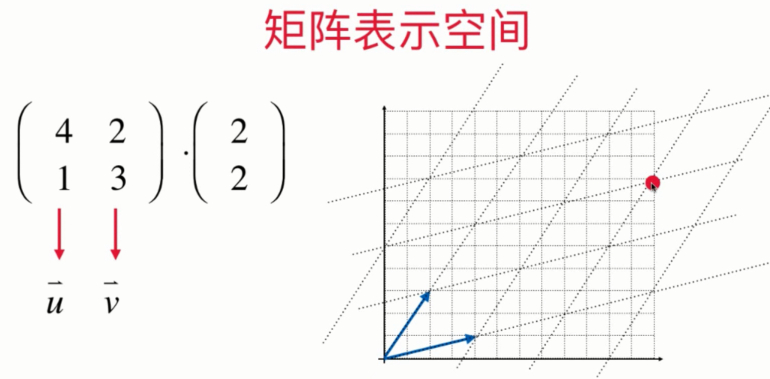

从空间的角度看待图形变换：把矩阵看做是一个空间，变换是把图形在新的空间所呈现的效果。
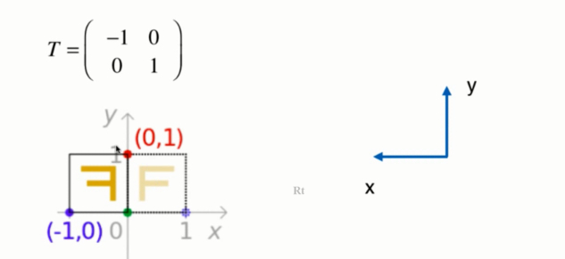
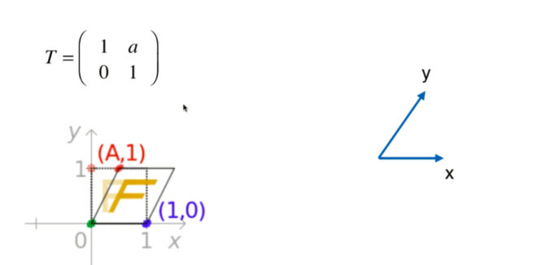
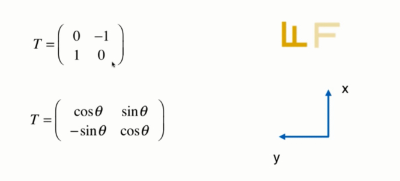

# 矩阵的性质有哪些？
1. 单位矩阵：I*A = A*I = A

2. 什么是矩阵的逆？
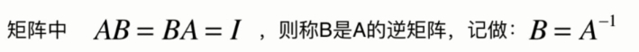
如果一个矩阵存在左逆矩阵B和右逆矩阵C，则B=C。
可逆矩阵一定是方阵，非方阵一定不可逆。
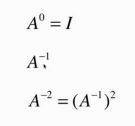

3. 逆矩阵的性质有哪些？
逆矩阵具有唯一性。
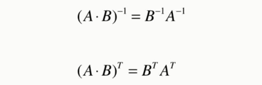
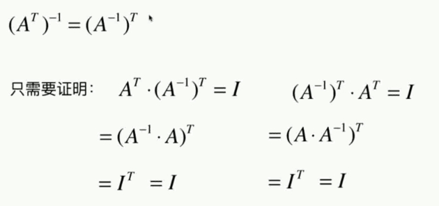

